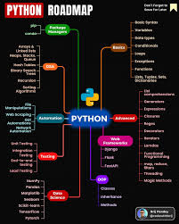
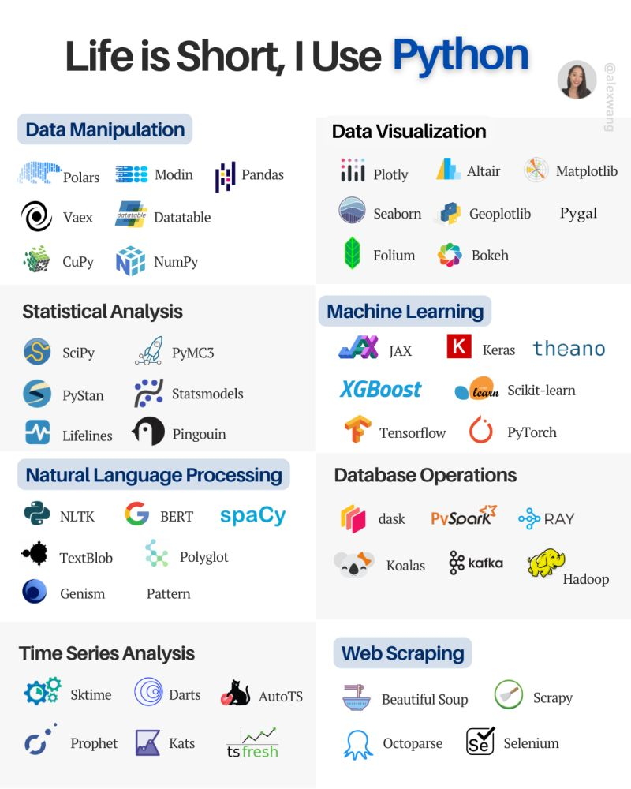
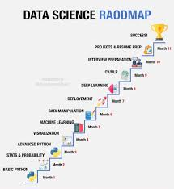

# Overview

Heading 1 Normal Text Heading 1 Normal Text Heading 1 Normal Text
Heading 1 Normal Text Heading 1 Normal Text Heading 1 Normal Text

## Road Maps

> Links overview

### Road Map to Python

### Python Library 1

### DataScience Roadmap

# Core Areas

Heading 1 Normal Text Heading 1 Normal Text Heading 1 Normal Text
Heading 1 Normal Text Heading 1 Normal Text Heading 1 Normal Text

## Common

-   **Path of Library:** \>
    /Library/Frameworks/Python.framework/Versions/3.13/lib/python3.13/site-packages

-   **Install Library:** pip install numpy or pip3 install numpy

## Basics

> Links overview

## Package Managers

> Links overview

## Data Science

> Links overview

### Num Py

**Links:**

-   [KeithGalli NumPy Github](https://www.youtube.com/watch?v=QUT1VHiLmmI&t=1041s)

-   [NumPy Routines](https://numpy.org/doc/stable/reference/routines.math.html)

## OOP

> Links overview

## Web Frameworks

> Links overview

## Testing

> Links overview

## DSA

> Links overview

## Automation

> Links overview

## Advanced

> Links overview
